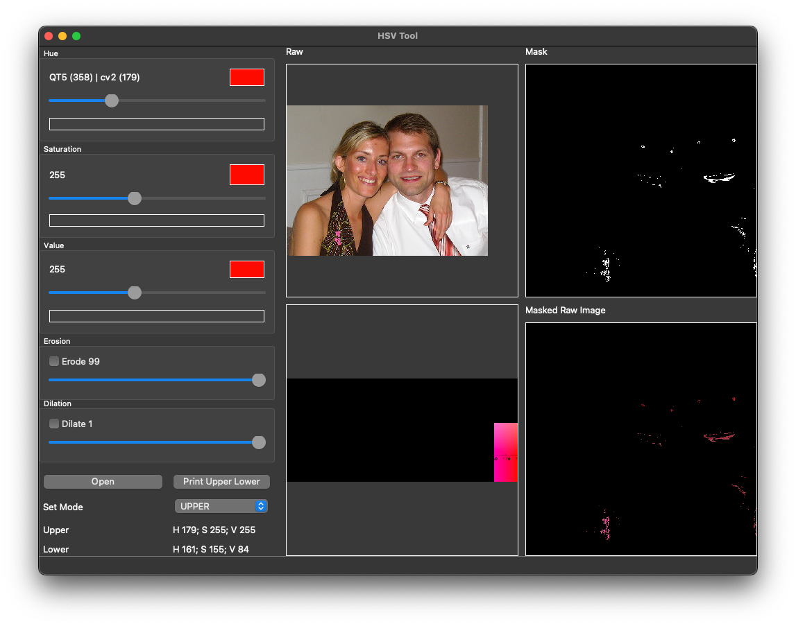

# HSV Range Tool
A tool for selecting optimal range (Including dilation and erotion) for HSV

## How to run:
Make sure you have `python` installed on your system. 
- Install pip for windows
```shell
py -3 -m ensurepip
```
Or macos:
```shell
python3 -m ensurepip
```
- Install Python environment:
```shell
sudo apt install python3
```
Or another way:
```shell
sudo apt-get install python3.6
```
- Before run the app, let installation required dependency by running:
```shell
pip install -r requirements.txt
```
- To start the app, let run the command for windows:
```shell
py main.py
```
For Mac OS:
```shell
python3 main.py
```
Or another way:
```shell
make run
```
# Instructions: 
Open a picture by clicking `Open` button

Adjust the Hue of both Upper range and Lower range before proceeding to adjust Saturation and Value (As adjusting Hue have the biggest impact)

You can use picture in `./example` for training, try to adjust the Upper and Lower range so only the ball is visible

You can also adjust `dilation` and `erotion` which usually used along with HSV in opencv computer vision project

